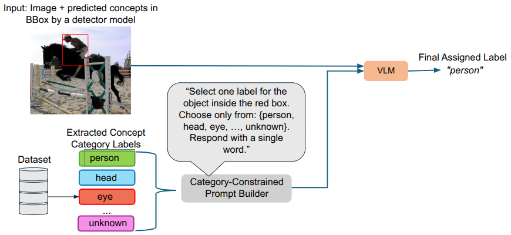
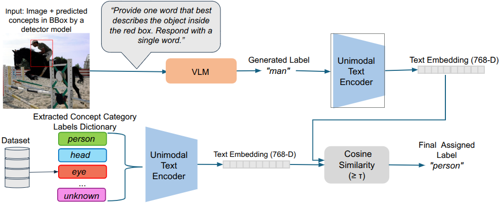

# CoCoLa & Open-CoCoLa  
**Pipelines for Hierarchical Conceptual Labeling with Multimodal Models Running on Ollama**

This repository provides two complementary pipelines for **concept-based annotation of objects and parts** in images using multimodal models executed locally through **Ollama**. Both pipelines are designed for **zero-shot experimentation**, **VLM evaluation**, and **Concept-Based Explainable AI (C-XAI)**.

- **CoCoLa (Closed-Set Concept Labeling)** – strictly chooses one concept from a predefined hierarchical dictionary.  
- **Open-CoCoLa (Open-Set Concept Labeling)** – free-form prediction → embedding → projection to the closest closed-set concept through **FAISS + embeddings**.




## 📌 Method Overview

### 🔒 **CoCoLa (Closed-Set)**  
1. A bounding box is drawn for each object or part.  
2. The cropped region is sent to Ollama with a **restricted set of valid labels**.  
3. The multimodal model must select **exactly one allowed concept**.  
4. The process is **hierarchical and recursive**: object → parts → subparts.

---

### 🔓 **Open-CoCoLa (Open-Set → Closed Projection)**  
1. The multimodal model generates **one free-form word** describing the content.  
2. The word is transformed into an embedding using `nomic-embed-text`.  
3. FAISS retrieves the **nearest concept** within a closed set.  
4. This projected concept becomes the root for the hierarchical part labeling.

---

## 🧠 Prompts Used

### **Closed-Set (CoCoLa)**
```
You are an expert image annotator.
Analyze ONLY the object highlighted in the image.
Possible labels: <list of labels>.
Select EXACTLY ONE label from the list.
Respond with ONLY ONE WORD from the list or 'unknown'.
```

### **Free-Form Prediction (Open-CoCoLa)**
```
You are an expert image annotator.
Analyze ONLY the content inside the red bounding box.
Respond with ONE WORD describing the object.
Do not include explanations.
```

### **Closed-Set for Parts (Open-CoCoLa)**
```
You are an expert image annotator.
Analyze ONLY the red bounding box.
Possible labels: <list of labels>.
Respond with ONE WORD from the list.
```

---

## 🏗️ Repository Structure

```
COCOLA/
│
├── src/
│   ├── cocola.py               # CoCoLa pipeline (closed-set)
│   ├── open_cocola.py          # Open-CoCoLa pipeline (open-set → projection)
│   ├── embeddings_builder.py   # FAISS index builder
│
├── data/
│   ├── images/                 # Dataset images
│   ├── json/                   # JSON annotations
│   ├── labels.json             # Hierarchical concept dictionary
│   ├── concepts_txt.txt        # Concept list (embeddings)
│
├── embeddings/
│   └── nomic-embed-text/
│       ├── concepts_index.faiss
│       └── concepts_metadata.pkl
│
├── images_readme/
│   ├── cocola.png
│   └── open_cocola.png
│
└── README_en.md
```

---

## 🚀 Requirements

### System
- Python **3.10+**
- **Ollama** installed and running locally

### Python Dependencies
```
pip install -r requirements.txt
```

### Required Ollama Models
```
ollama pull llava:7b
ollama pull nomic-embed-text:latest
ollama serve
```

---

## 📊 Building the FAISS Index (Open-CoCoLa)

```
python3 src/embeddings_builder.py \
   --concepts_txt data/concepts_txt.txt \
   --embed_model "nomic-embed-text:latest" \
   --output_dir embeddings/nomic-embed-text/
```

---

## 🔒 Running CoCoLa

```
python3 src/cocola.py \
   --model "llava:7b" \
   --port 11434 \
   --labels data/labels.json \
   --input_json data/json/ \
   --input_images data/images/ \
   --output output/
```

---

## 🔓 Running Open-CoCoLa

```
python3 src/open_cocola.py \
   --model "llava:7b" \
   --port 11434 \
   --embed_model "nomic-embed-text:latest" \
   --concepts data/labels.json \
   --faiss_index embeddings/nomic-embed-text/concepts_index.faiss \
   --faiss_metadata embeddings/nomic-embed-text/concepts_metadata.pkl \
   --faiss_threshold 0.50 \
   --input_json data/json/ \
   --input_images data/images/ \
   --output output/
```

---

## 📤 Example Outputs

### **CoCoLa**
```json
{
  "image_name": "000001",
  "objects": [
    {
      "class": "car",
      "predicted_class_con_labels": "car",
      "parts": [
        {
          "class": "wheel",
          "predicted_part_con_labels": "rim",
          "parts": []
        }
      ]
    }
  ]
}
```

### **Open-CoCoLa**
```json
{
  "predicted_class_sin_labels": "auto",
  "faiss_predicted": "car"
}
```

---

## 📝 Notes

- Default Ollama port is `11434`.
- If FAISS similarity < threshold → concept becomes `"unknown"`.
- Prompts enforce **single-word outputs**.
- Keep concept dictionaries clean and lowercase.

---

## 👤 Author

**Darian Fernández**  
License: **MIT**
